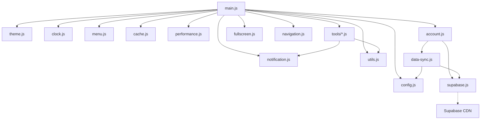

# Architecture JavaScript

Ce document décrit l'architecture et les dépendances des modules JavaScript de l'application.

## Diagramme de dépendances

## Principaux modules

### main.js
- Point d'entrée de l'application
- Initialise tous les gestionnaires principaux
- Contrôle le chargement des outils

### supabase.js
- Gère l'authentification avec Supabase
- Fournit les fonctions de connexion, déconnexion, inscription
- Crée le client Supabase avec les clés d'API

### data-sync.js
- Gère la synchronisation des données entre le stockage local et Supabase
- Supporte le mode hors ligne avec file d'attente de synchronisation
- Gère les conflits de données

### account.js
- Gère l'interface utilisateur pour l'authentification
- Crée le panneau de compte avec les formulaires de connexion, inscription et réinitialisation de mot de passe
- Communique avec supabase.js pour les opérations d'authentification

### notification.js
- Affiche des notifications à l'utilisateur
- Supporte différents types de notifications (info, succès, erreur, avertissement)

### cache.js
- Gère le cache pour améliorer les performances
- Nettoie les entrées expirées

### performance.js
- Surveille les performances de l'application
- Fournit des utilitaires pour déboguer les problèmes de performance

## Flux d'initialisation

1. `main.js` est chargé
2. `init()` est appelé dans la classe App
3. Les services essentiels sont initialisés (cache, performance)
4. L'interface utilisateur est initialisée (menu, fullscreen)
5. L'authentification est initialisée via `initAccountManager()`
6. Les gestionnaires d'outils sont configurés pour être initialisés à la demande

## Authentification et synchronisation

Le processus d'authentification fonctionne comme suit:

1. Le CDN Supabase est chargé dans `index.html`
2. Le module `supabase.js` crée un client Supabase avec les clés d'API
3. `initAuth()` vérifie la session existante et configure les écouteurs d'événements
4. `account.js` crée l'interface utilisateur pour l'authentification
5. Lorsqu'un utilisateur se connecte, `data-sync.js` est initialisé pour synchroniser les données

## Configuration

Toute la configuration de l'application est centralisée dans `config.js` avec:

- Version de l'application
- Clés de stockage local
- Configuration PWA
- Paramètres de synchronisation
- Gestion des erreurs

## Bonnes pratiques

1. **Modules autonomes**: Chaque module a une responsabilité unique
2. **Initialisation explicite**: Les modules exposent une méthode `init()` appelée au moment approprié
3. **Gestion des erreurs**: Toutes les fonctions asynchrones gèrent correctement les erreurs
4. **Accessibilité**: Les éléments d'interface utilisateur sont créés avec des attributs ARIA appropriés 